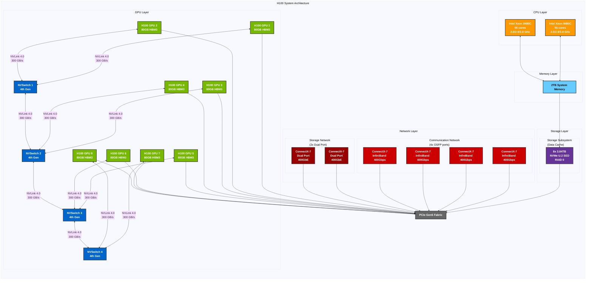
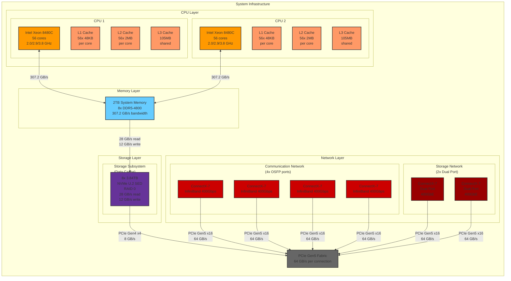

# NVIDIA H100 NVLink Architecture

This diagram illustrates the NVLink connections between GPUs in an NVIDIA H100 system. The H100 uses NVLink 4.0, which provides high-speed GPU-to-GPU communication.

## Complete H100 System Architecture

The following diagram shows the complete H100 system architecture including CPUs, GPUs, PCIe fabric, NVSwitch, and network connectivity.

## Key Features

- Each H100 GPU has 18 NVLink 4.0 lanes
- Each NVLink 4.0 lane provides 50 GB/s bandwidth
- Each GPU-to-GPU connection uses 6 lanes (300 GB/s)
- Total NVLink bandwidth of up to 900 GB/s per GPU
- Full mesh topology for optimal communication
- Direct GPU-to-GPU communication without CPU intervention
- Support for up to 8 GPUs in a single system

## System Architecture Details

- **CPUs**: 2x Intel Xeon 8480C PCIe Gen5 CPUs
  - 56 cores each
  - 2.0/2.9/3.8 GHz (base/all core turbo/Max turbo)
- **System Memory**: 2TB total
- **GPUs**: 8x NVIDIA H100 GPUs
  - 80GB HBM3 memory each
  - 640GB total GPU memory
- **NVSwitch**: 4x 4th generation NVSwitches
  - 900 GB/s GPU-to-GPU bandwidth
- **Storage**:
  - 8x 3.84 TB NVMe U.2 SED drives
  - Configured in RAID 0 array
- **Network**:
  - **Communication Network** (4x OSFP ports):
    - 8x NVIDIA ConnectX-7 Single Port InfiniBand Cards
    - InfiniBand: Up to 400Gbps
    - Ethernet: 400GbE, 200GbE, 100GbE, 50GbE, 40GbE, 25GbE, 10GbE
  - **Storage Network** (2x Dual Port):
    - 2x NVIDIA ConnectX-7 Dual Port Ethernet Cards
    - Ethernet: 400GbE, 200GbE, 100GbE, 50GbE, 40GbE, 25GbE, 10GbE
    - InfiniBand: Up to 400Gbps
- **PCIe Fabric**: Gen5 PCIe providing 64 GB/s per connection

## Notes

- The diagram shows the exact number of NVLink lanes between each GPU pair
- Each connection represents 6 NVLink lanes, providing 300 GB/s bandwidth
- The total bandwidth per GPU is distributed across multiple connections
- The actual physical layout may vary depending on the specific H100 system configuration
- NVLink 4.0 provides improved power efficiency and reliability compared to previous generations
- The system supports both direct GPU-to-GPU communication via NVLink and CPU-mediated communication via PCIe
- **Communication Network** provides high-speed InfiniBand connectivity for GPU-to-GPU communication across nodes
- **Storage Network** provides dedicated high-speed Ethernet connectivity for storage access
- The storage subsystem uses NVMe U.2 SED drives in a RAID 0 configuration for maximum performance 

## NVLink Topology Details

- Each H100 GPU has 18 NVLink 4.0 lanes
- Each NVLink 4.0 lane provides 50 GB/s bandwidth
- Each GPU-to-GPU connection uses 6 lanes (300 GB/s)
- Total NVLink bandwidth of up to 900 GB/s per GPU
- Full mesh topology for optimal communication
- Direct GPU-to-GPU communication without CPU intervention

### Connection Types

2. **GPU-to-NVSwitch Connections**:
   - Each GPU pair connects to one NVSwitch
   - Each connection provides 300 GB/s bandwidth

3. **NVSwitch-to-NVSwitch Connections**:
   - NVSwitch1 ↔ NVSwitch2
   - NVSwitch2 ↔ NVSwitch3
   - NVSwitch3 ↔ NVSwitch4
   - Enables communication between all GPUs 

## System Infrastructure Architecture

The following diagram illustrates the system infrastructure components including CPUs, Memory, PCI Bus, and Network connectivity.

## System Infrastructure Details

### CPU Configuration
- 2x Intel Xeon 8480C PCIe Gen5 CPUs
  - 56 cores each
  - 2.0/2.9/3.8 GHz (base/all core turbo/Max turbo)
  - Cache Hierarchy:
    - L1 Cache: 48KB per core (56 cores)
    - L2 Cache: 2MB per core (56 cores)
    - L3 Cache: 105MB shared

### Memory Configuration
- 2TB total system memory
- 8x DDR5-4800 DIMMs
- Memory bandwidth: 307.2 GB/s per CPU
- Direct connection to both CPUs

### Storage Configuration
- 8x 3.84 TB NVMe U.2 SED drives
- Configured in RAID 0 array
- Performance:
  - Read bandwidth: 28 GB/s
  - Write bandwidth: 12 GB/s
- Connected to system memory and PCIe fabric
- PCIe Gen4 x4 interface (8 GB/s per drive)

### Network Configuration
1. **Communication Network** (4x OSFP ports):
   - 4x NVIDIA ConnectX-7 Single Port InfiniBand Cards
   - InfiniBand: Up to 400Gbps
   - Ethernet: 400GbE, 200GbE, 100GbE, 50GbE, 40GbE, 25GbE, 10GbE
   - PCIe Gen5 x16 interface (64 GB/s)

2. **Storage Network** (2x Dual Port):
   - 2x NVIDIA ConnectX-7 Dual Port Ethernet Cards
   - Ethernet: 400GbE, 200GbE, 100GbE, 50GbE, 40GbE, 25GbE, 10GbE
   - InfiniBand: Up to 400Gbps
   - PCIe Gen5 x16 interface (64 GB/s)

### PCIe Fabric
- Gen5 PCIe providing 64 GB/s per connection
- Central connection point for all components
- Enables high-speed communication between all system components 