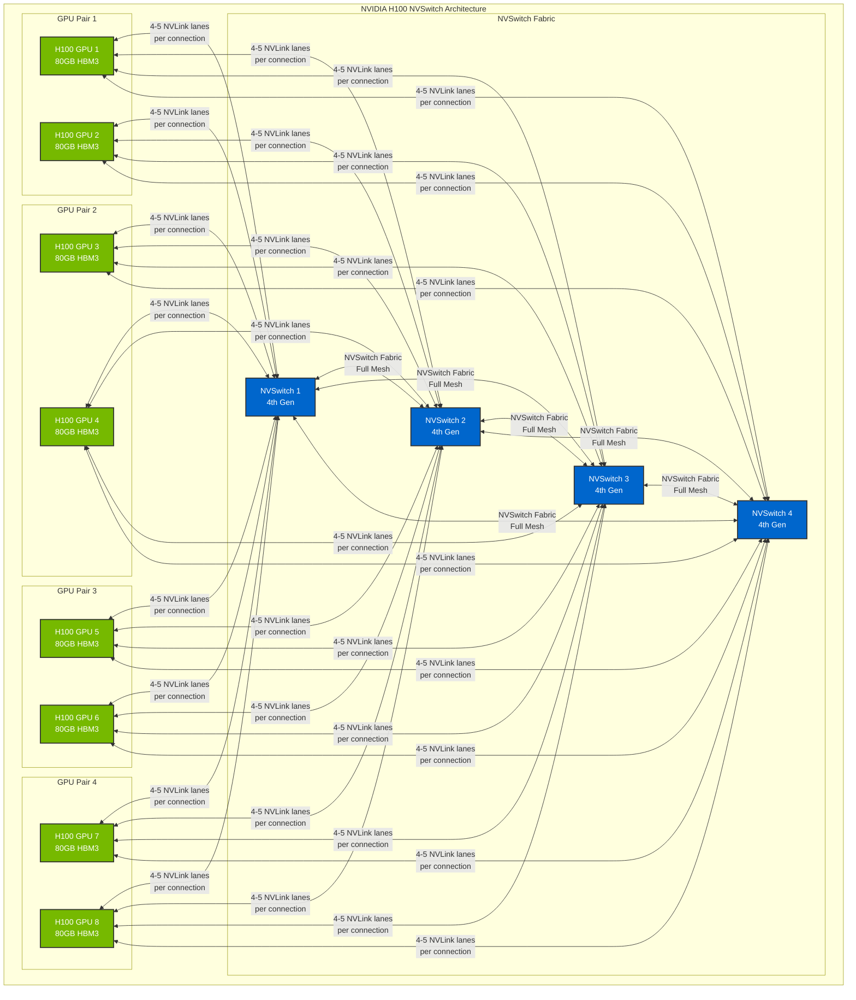

# NVIDIA H100 NVLink Topology

## Style Definitions

The following class definitions can be reused across all H100 system diagrams for consistent styling:

This diagram illustrates NVLink connections between GPUs and NVSwitches in an NVIDIA H100 system. **H100 GPUs do NOT connect directly to each other** - they only connect to NVSwitches, which provide the full mesh connectivity.

## H100 Architecture

### Key Facts About H100 NVLink Topology:
- Each H100 GPU has **18 NVLink 4.0 ports total**
- All 18 ports connect to NVSwitches (distributed across the 4 NVSwitches)
- Each NVLink 4.0 lane provides **50 GB/s bandwidth**
- Total bandwidth per GPU: **900 GB/s** (18 lanes × 50 GB/s)
- NVSwitches provide **full mesh connectivity** between all GPUs
- 4th generation NVSwitches handle all GPU-to-GPU communication

### Architecture:
1. **8 H100 GPUs** connect only to **4 NVSwitches**
2. Each GPU distributes its 18 NVLink lanes across all 4 NVSwitches
3. Typical distribution: **4-5 lanes per NVSwitch** per GPU
4. NVSwitches form a **full mesh fabric** for GPU-to-GPU communication
5. Any GPU can communicate with any other GPU through the NVSwitch fabric

### Bandwidth Distribution:
- **Per GPU**: 18 NVLink lanes × 50 GB/s = **900 GB/s total**
- **Per NVSwitch connection**: 4-5 lanes × 50 GB/s = **200-250 GB/s**
- **Aggregate system bandwidth**: Massive parallel bandwidth through NVSwitch fabric
- **No bottlenecks**: Full mesh ensures optimal communication paths

### Why NVSwitches Are Essential:
- **Scalability**: Support for 8 GPUs with full mesh connectivity
- **Bandwidth**: No bandwidth reduction compared to direct connections
- **Flexibility**: Dynamic routing and load balancing
- **Reliability**: Redundant paths and fault tolerance
- **Simplicity**: Eliminates complex direct GPU wiring

## Connection Details

### GPU-to-NVSwitch Connections Only:
- **Each GPU** connects to **all 4 NVSwitches**
- **18 NVLink lanes per GPU** distributed across NVSwitches
- **No direct GPU-to-GPU connections**
- NVSwitches handle all inter-GPU communication

### NVSwitch Fabric:
- **4 NVSwitches** form a full mesh fabric
- Each NVSwitch connects to all other NVSwitches
- Provides multiple paths for GPU-to-GPU communication
- Enables optimal bandwidth utilization

### Bandwidth Specifications:
- **NVLink 4.0**: 50 GB/s per lane
- **18 lanes per GPU**: 900 GB/s total per GPU
- **Lane distribution**: 4-5 lanes per NVSwitch per GPU
- **Total system bandwidth**: Massive aggregate through fabric

### Topology Benefits:
- **True full mesh**: Every GPU can communicate with every other GPU
- **No CPU involvement**: Direct GPU-to-GPU transfers through NVSwitch
- **Optimal bandwidth**: No reduction compared to direct connections  
- **Scalable architecture**: Clean, manageable topology
- **High reliability**: Multiple paths and redundancy
- **Load balancing**: NVSwitches optimize traffic routing 