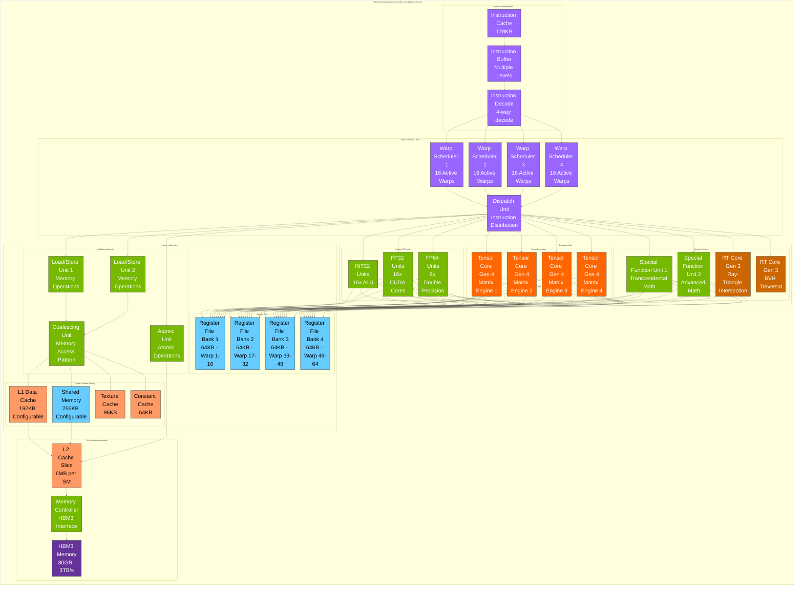
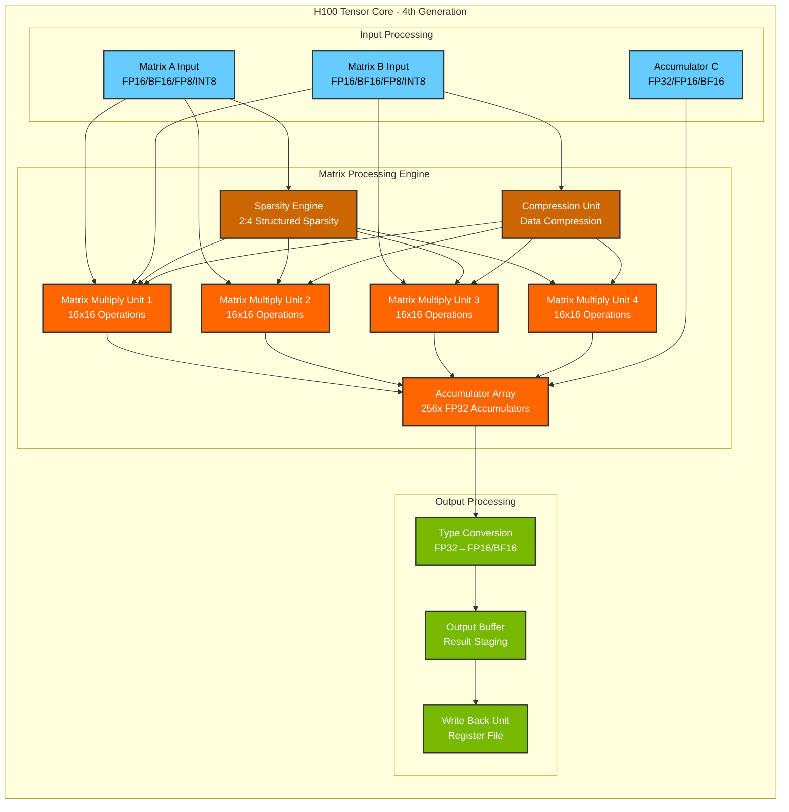
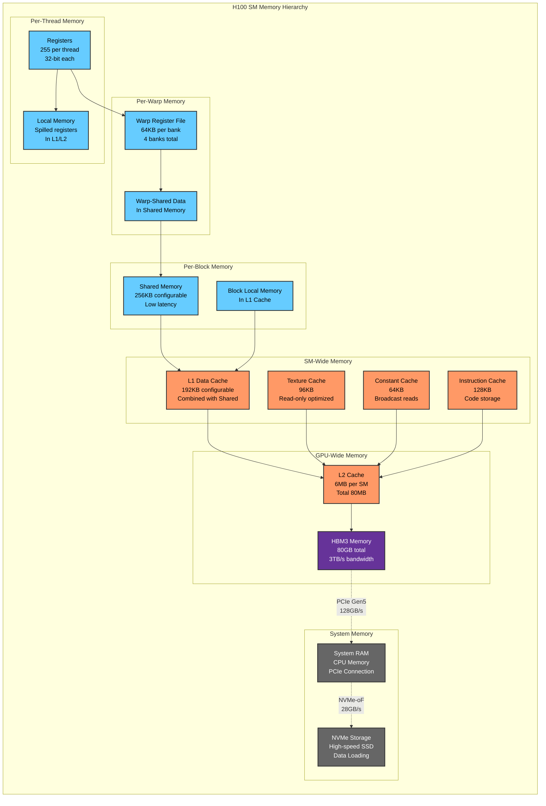

# NVIDIA H100 Streaming Multiprocessor Architecture

## Color Palette & Style Guide

The following color scheme is used consistently across all H100 system diagrams for visual clarity and component identification:

## H100 Streaming Multiprocessor Overview

This comprehensive guide illustrates the internal architecture of a single Streaming Multiprocessor (SM) in the NVIDIA H100 GPU, showing the complete data flow, execution pipeline, and memory hierarchy.

### High-Level SM Architecture

## Detailed Component Architecture

### Tensor Core Architecture (4th Generation)

### Memory Hierarchy and Data Flow

## Comprehensive Technical Specifications

### Execution Units Specifications

#### CUDA Cores (FP32 Units)
- **Count**: 128 CUDA cores per SM (4 blocks × 32 cores)
- **Operations**: Single-precision floating-point, integer
- **Throughput**: 2,048 FP32 operations per clock (fused multiply-add)
- **Clock Speed**: 1.755 GHz boost, 1.41 GHz base
- **Peak Performance**: 3.6 TFlops FP32 per SM

#### Tensor Cores (4th Generation)
- **Count**: 4 Tensor Cores per SM
- **Matrix Size**: 16×16 native, larger via software tiling
- **Data Types Supported**:
  - **FP16**: 256 TFlops per SM
  - **BF16**: 256 TFlops per SM  
  - **TF32**: 128 TFlops per SM
  - **FP8**: 512 TFlops per SM
  - **INT8**: 512 TOps per SM
  - **INT4**: 1024 TOps per SM
- **Sparsity Support**: 2:4 structured sparsity (50% sparsity)
- **New Features**: FP8 support, enhanced sparsity, improved efficiency

#### RT Cores (3rd Generation)
- **Count**: 2 RT cores per SM (132 total per GPU)
- **Function**: Hardware-accelerated ray tracing
- **Operations**: Ray-triangle intersection, BVH traversal
- **Performance**: 2.5× faster than RT Cores Gen 2
- **New Features**: Improved BVH traversal, opacity micromap support

#### Special Function Units (SFUs)
- **Count**: 4 SFUs per SM
- **Functions**: 
  - Transcendental math (sin, cos, log, exp, sqrt)
  - Reciprocal operations
  - Interpolation functions
  - Type conversion operations
- **Throughput**: 32 operations per clock per SFU
- **Precision**: Full IEEE 754 compliance

### Memory Subsystem Specifications

#### Register File
- **Total Capacity**: 256KB per SM (4 banks × 64KB)
- **Access Pattern**: 4-way banked for conflict-free access
- **Registers per Thread**: Up to 255 32-bit registers
- **Bandwidth**: 64KB per clock cycle
- **Latency**: 1 clock cycle

#### Shared Memory
- **Capacity**: 256KB per SM (configurable with L1)
- **Bank Count**: 32 banks for conflict-free access
- **Bank Width**: 32 bits (4 bytes)
- **Bandwidth**: 256KB per clock cycle
- **Latency**: ~20 clock cycles
- **Access Patterns**: Supports broadcasts, multicasts

#### L1 Data Cache
- **Capacity**: 192KB per SM (configurable with shared memory)
- **Configuration Options**:
  - 128KB L1 + 128KB shared memory
  - 96KB L1 + 160KB shared memory  
  - 64KB L1 + 192KB shared memory
- **Cache Line**: 128 bytes
- **Bandwidth**: 192KB per clock cycle
- **Latency**: ~80 clock cycles

#### Texture Cache
- **Capacity**: 96KB per SM
- **Purpose**: Optimized for 2D/3D spatial locality
- **Features**: Hardware filtering, format conversion
- **Bandwidth**: High throughput for texture operations
- **Access Pattern**: Optimized for graphics workloads

#### Constant Cache
- **Capacity**: 64KB per SM
- **Purpose**: Read-only data with broadcast capability
- **Access Pattern**: Single read broadcasts to entire warp
- **Latency**: ~20 clock cycles for cached data
- **Use Cases**: Shader constants, lookup tables

### Warp Scheduling and Execution

#### Warp Management
- **Warps per SM**: 64 warps maximum (2,048 threads)
- **Active Warps**: 64 warps can be resident simultaneously
- **Warp Schedulers**: 4 schedulers per SM
- **Dispatch Width**: Each scheduler can issue 1 instruction per clock
- **Warp Size**: 32 threads per warp (industry standard)

#### Instruction Pipeline
- **Pipeline Depth**: ~20 stages for arithmetic operations
- **Instruction Issue**: 4 instructions per clock (1 per scheduler)
- **Instruction Types**:
  - Arithmetic: Integer, FP32, FP64
  - Memory: Load, store, atomic operations
  - Control: Branch, predicate, barrier
  - Special: Tensor operations, RT operations

#### Latency Hiding
- **Thread Context**: Zero-overhead context switching
- **Latency Tolerance**: 200+ clock cycles hidden
- **Occupancy**: Up to 2,048 active threads per SM
- **Warp Switching**: Single clock cycle warp switch

### Power and Efficiency Specifications

#### Power Consumption
- **TDP**: 700W total GPU power
- **Power per SM**: ~5.3W per SM (132 SMs total)
- **Voltage**: Multiple voltage domains for optimization
- **Power States**: Multiple P-states for dynamic power management

#### Efficiency Improvements
- **Manufacturing Process**: TSMC 4nm (N4)
- **Transistor Count**: 80 billion transistors
- **Die Size**: 814 mm²
- **Energy Efficiency**: 2.5× improvement over A100
- **Clock Gating**: Fine-grained power management
- **Voltage Scaling**: Dynamic voltage and frequency scaling

## Performance Characteristics

### Computational Performance
- **FP32 Performance**: 60 TFlops (boost clock)
- **Tensor Performance**: 4,000 TFlops (FP8 sparse)
- **RT Performance**: 456 RT Cores operations
- **Memory Bandwidth**: 3TB/s HBM3
- **PCIe Bandwidth**: 128GB/s (PCIe Gen5 x16)

### Scalability Metrics
- **Thread Scalability**: 2,048 threads per SM
- **Memory Scalability**: 3TB/s peak bandwidth
- **Compute Scalability**: 132 SMs total
- **Network Scalability**: 900GB/s NVLink per GPU

### Use Case Optimization
- **AI Training**: Optimized for large language models
- **AI Inference**: High throughput, low latency
- **Scientific Computing**: Double precision, large memory
- **Graphics Rendering**: RT cores, rasterization
- **Data Analytics**: High memory bandwidth, parallel processing 